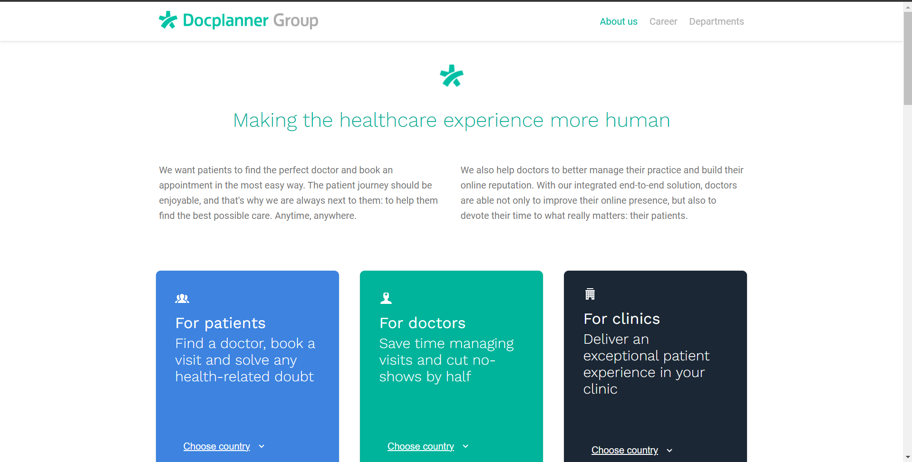
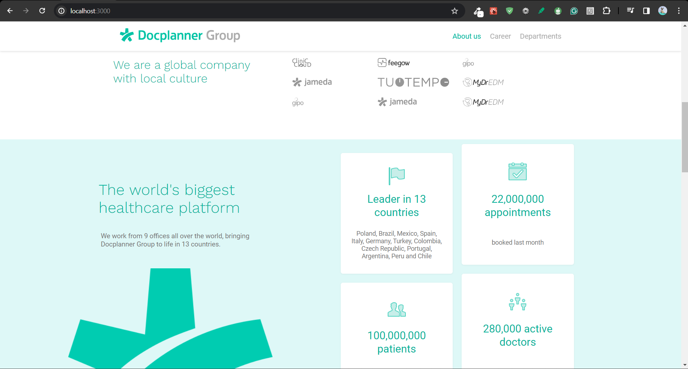
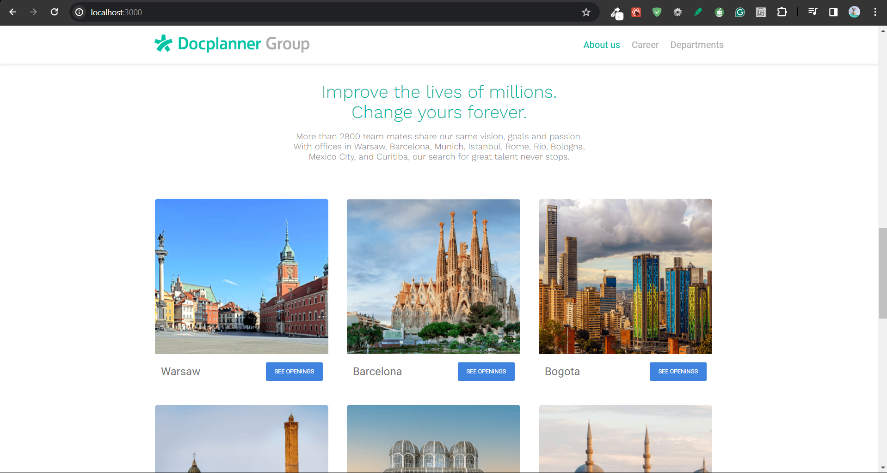
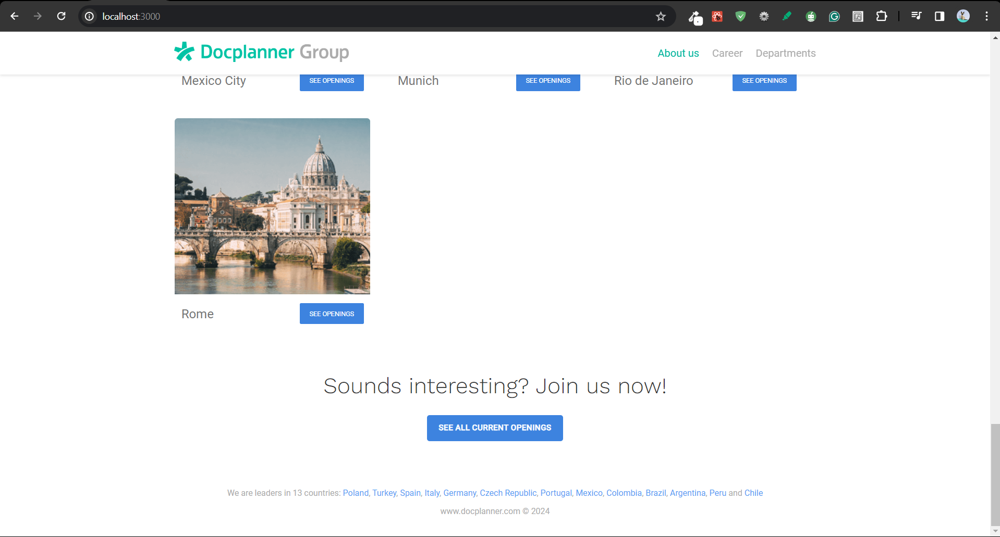
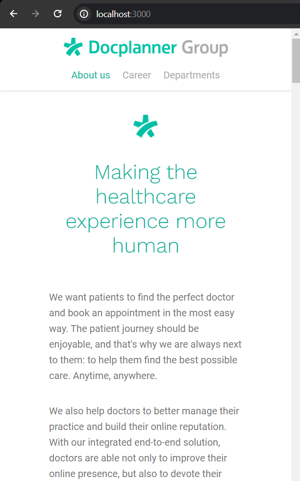
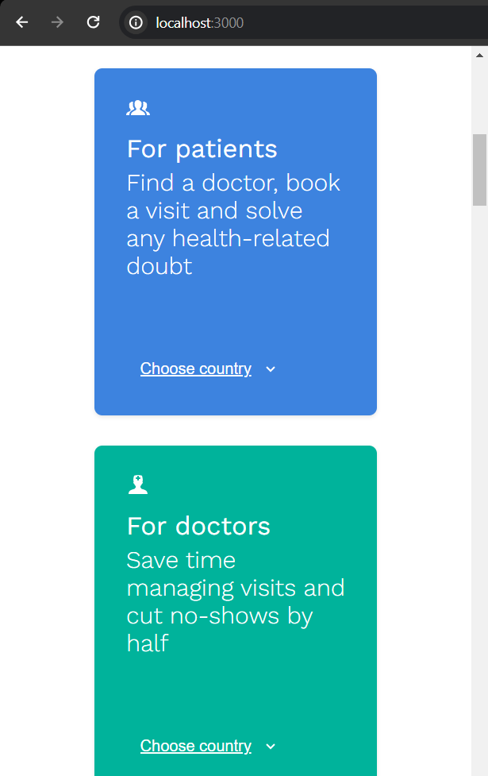
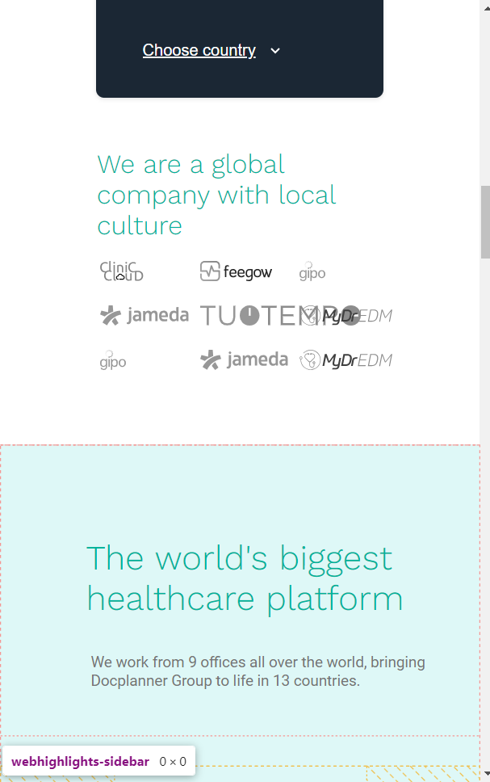
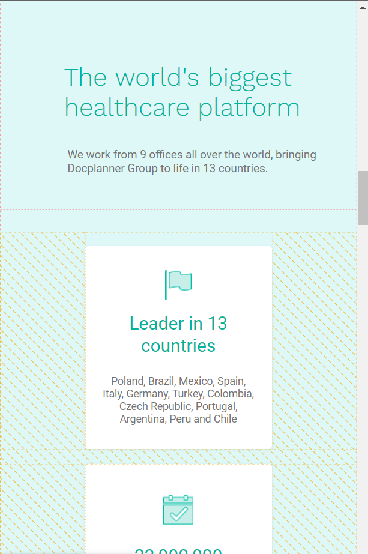
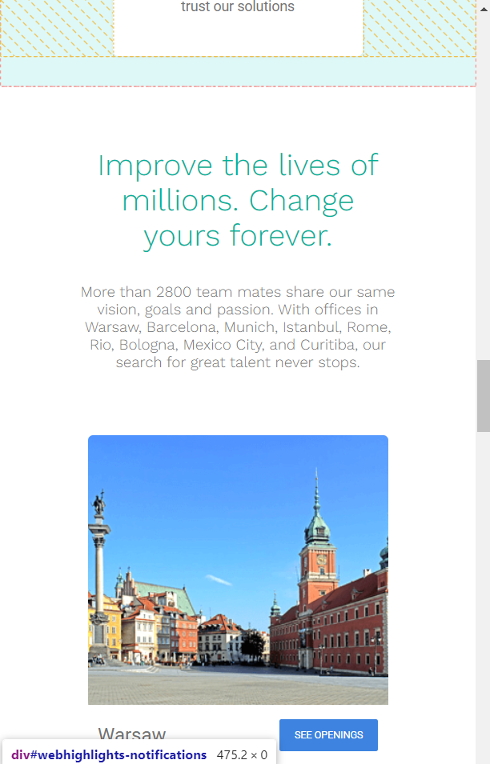
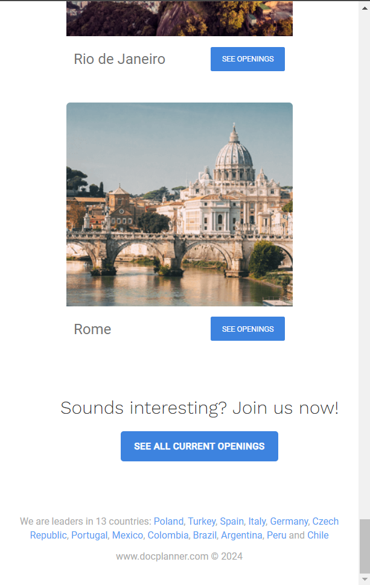

# Docplanner Clone

This project is a clone of the Docplanner website (https://www.docplanner.com/), intended to demonstrate a frontend development skill set including React.js, SASS, SEO, and WCAG compliance.

## Overview

The goal of this project is to replicate the design and functionality of the Docplanner website, with a focus on creating a responsive and accessible user experience. The project uses React.js for the frontend to create a dynamic and interactive user interface, alongside SASS for advanced styling capabilities.

## Features

- **React.js**: A JavaScript library for building user interfaces.
- **SASS (SCSS Syntax)**: A powerful extension of CSS that allows for variables, nested rules, mixins, and more.
- **SEO-Friendly**: Implementing best practices to ensure the website is optimized for search engines.
- **WCAG Compliant**: Ensuring the website is accessible to a wide range of people, including those with disabilities.
- **Responsive Design**: The layout works on desktops, tablets, and mobile phones.

## Project Structure

The project is structured with a focus on component modularity and styling cohesion. Each React component has a corresponding SASS file, and all styling is centralized through a main SASS file.

## Quick Note

The build for GitHub Pages has been pushed, but there's an issue preventing the application from going live. Below are some screenshots to illustrate the application's look on desktop and mobile views.

## Screenshots

### Desktop Layout






### Mobile Layout









## Setup

To run this project locally:

```sh
git clone https://github.com/your-username/your-repo-name.git
npm install
npm start